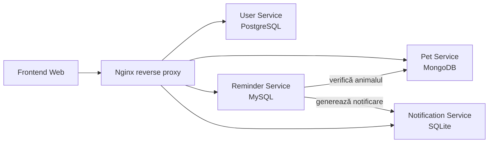

# Pet Care Reminder App

Aplicație web bazată pe **microservicii** pentru gestionarea activităților de îngrijire a animalelor de companie. Utilizatorii pot crea conturi, adăuga animale, crea remindere (hrană, baie, plimbare, vaccin, medicamente, vizite veterinare) și vizualiza notificările generate pentru activitățile programate.

## Cuprins

- [Echipă](#echipă)
- [Arhitectură](#arhitectură)
- [Structura proiectului](#structura-proiectului)
- [Cerințe](#cerințe)
- [Instalare](#instalare)
- [Rulare](#rulare)
- [API](#api)
- [Deployment](#deployment)

## Echipă

| Membru | Responsabilitate principală |
|--------|------------------------------|
| Rancov Larisa | User Service (PostgreSQL), Notification Service (SQLite) |
| Șerban Alexia | Pet Service (MongoDB) |
| Raț Ioan-Paul | Reminder Service (MySQL), frontend, deployment AWS |

## Arhitectură

Aplicația este compusă din patru microservicii independente, fiecare cu propriul API REST și propria bază de date. Comunicarea între servicii se face exclusiv prin REST. Un reverse proxy Nginx expune serviciile sub un singur domeniu și servește frontend-ul static.

| Serviciu | Port | Bază de date | Rută Nginx |
|----------|------|--------------|------------|
| `user-service` | 3001 | PostgreSQL | `/api/users` |
| `pet-service` | 3002 | MongoDB | `/api/pets` |
| `reminder-service` | 3003 | MySQL | `/api/reminders` |
| `notification-service` | 3004 | SQLite | `/api/notifications` |



## Structura proiectului

```text
pet-care-reminder-app/
├── docker-compose.yml          # orchestrarea serviciilor și a bazelor de date
├── package.json                # npm workspaces (instalare unică pentru tot proiectul)
├── README.md
├── frontend/                   # interfața web servită prin Nginx
│   ├── index.html
│   ├── css/
│   │   └── style.css
│   └── js/
│       └── app.js
├── nginx/
│   └── default.conf            # reverse proxy + servire frontend
└── services/
    ├── user-service/           # Node.js + Express + PostgreSQL
    ├── pet-service/            # Node.js + Express + MongoDB
    ├── reminder-service/       # Node.js + Express + MySQL
    └── notification-service/   # Node.js + Express + SQLite
```

Fiecare microserviciu respectă aceeași structură internă, cu separarea clară a responsabilităților:

```text
<service>/
├── Dockerfile                  # construirea containerului pentru deployment
├── package.json                # dependențele serviciului
├── .dockerignore
├── .env.example                # variabilele de mediu necesare
└── src/
    ├── index.js                # bootstrap-ul serverului Express
    ├── routes/                 # definirea endpoint-urilor REST
    ├── controllers/            # validarea request-ului și apelul logicii de business
    ├── services/               # logica principală a microserviciului
    ├── repositories/           # accesul la baza de date
    └── db/                     # configurarea conexiunii la baza de date
```

## Cerințe

- Node.js 20+
- npm 9+ (suport pentru workspaces)
- Docker + Docker Compose (pentru rularea completă cu baze de date)

## Instalare

Proiectul folosește **npm workspaces**, astfel încât o singură comandă rulată în rădăcina proiectului instalează dependențele tuturor microserviciilor:

```bash
npm install
```

Toți membrii echipei rulează aceeași comandă și obțin exact aceleași versiuni de dependențe, fixate în `package-lock.json` (care se comite în Git). Fiecare microserviciu își declară dependențele în propriul `package.json`.

## Rulare

### Rulare completă cu Docker (recomandat)

Pornește toate microserviciile, bazele de date și Nginx:

```bash
docker compose up --build
```

- Frontend: <http://localhost>
- API: `http://localhost/api/...`

### Rulare individuală a unui serviciu (dezvoltare)

```bash
npm run start:user
npm run start:pet
npm run start:reminder
npm run start:notification
```

## API

| Serviciu | Endpoint-uri principale |
|----------|--------------------------|
| User | `POST /users`, `GET /users`, `GET /users/{id}` |
| Pet | `POST /pets`, `GET /pets`, `GET /pets/{id}`, `GET /pets/user/{userId}`, `DELETE /pets/{id}` |
| Reminder | `POST /reminders`, `GET /reminders`, `GET /reminders/active`, `GET /reminders/pet/{petId}`, `PUT /reminders/{id}/done`, `DELETE /reminders/{id}` |
| Notification | `POST /notifications`, `GET /notifications`, `GET /notifications/user/{userId}`, `GET /notifications/reminder/{reminderId}`, `PUT /notifications/{id}/sent`, `PUT /notifications/{id}/read`, `DELETE /notifications/{id}` |

## Deployment

Aplicația este pregătită pentru deployment pe **AWS EC2 (Ubuntu)** folosind Docker Compose și Nginx ca reverse proxy. Bazele de date rulează în containere separate, cu volume persistente.
