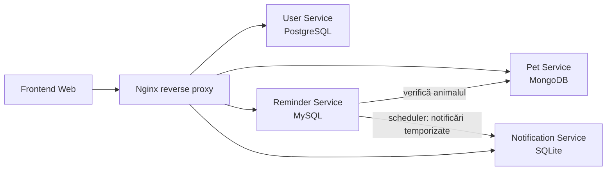
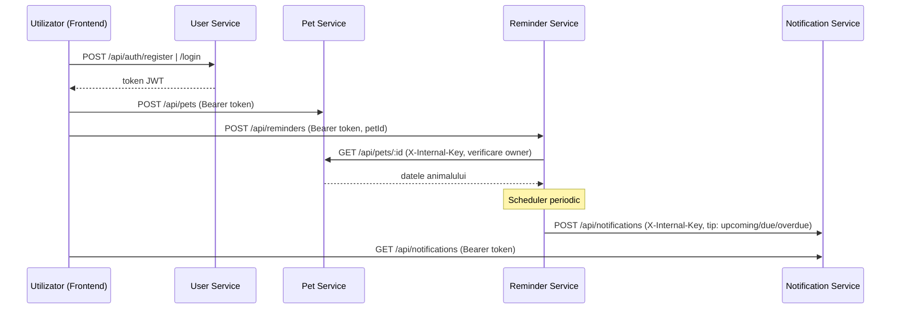

# Pet Care Reminder App

Aplicație web bazată pe **microservicii** pentru gestionarea activităților de îngrijire a animalelor de companie. Utilizatorii își creează un cont (autentificare cu **JWT**), adaugă animale, creează remindere (hrană, baie, plimbare, vaccin, medicamente, vizite veterinare) și primesc automat **notificări temporizate** pe măsură ce data unui reminder se apropie, ajunge la zi sau este depășită. Fiecare utilizator vede exclusiv propriile date.

## Cuprins

- [Echipă](#echipă)
- [Arhitectură](#arhitectură)
- [Autentificare și securitate](#autentificare-și-securitate)
- [Fluxul aplicației](#fluxul-aplicației)
- [Structura proiectului](#structura-proiectului)
- [Cerințe](#cerințe)
- [Instalare](#instalare)
- [Rulare](#rulare)
- [Variabile de mediu](#variabile-de-mediu)
- [API](#api)
- [Deployment pe AWS EC2](#deployment-pe-aws-ec2)
- [Persistența datelor](#persistența-datelor)
- [Depanare](#depanare)

## Echipă

| Membru | Responsabilitate principală |
|--------|------------------------------|
| Rancov Larisa | User Service (PostgreSQL), Notification Service (SQLite) |
| Șerban Alexia | Pet Service (MongoDB) |
| Raț Ioan-Paul | Reminder Service (MySQL), frontend, deployment AWS |

## Arhitectură

Aplicația este compusă din patru microservicii independente, fiecare cu propriul API REST și propria bază de date. Comunicarea între servicii se face exclusiv prin REST. Un reverse proxy Nginx expune serviciile sub un singur domeniu și servește frontend-ul static.

| Serviciu | Port | Bază de date | Rută Nginx |
|----------|------|--------------|------------|
| `user-service` | 3001 | PostgreSQL | `/api/auth` |
| `pet-service` | 3002 | MongoDB | `/api/pets` |
| `reminder-service` | 3003 | MySQL | `/api/reminders` |
| `notification-service` | 3004 | SQLite | `/api/notifications` |

`reminder-service` rulează în plus un **scheduler intern** care verifică periodic reminderele și cere `notification-service` să genereze notificări temporizate (când un reminder se apropie, este astăzi sau a rămas în urmă).



## Autentificare și securitate

Accesul la date este protejat printr-un sistem de autentificare cu **JSON Web Tokens (JWT)**:

- La înregistrare/login, `user-service` emite un token JWT semnat. Parolele sunt stocate hashuite cu **bcrypt**, niciodată în clar.
- Frontend-ul trimite token-ul în antetul `Authorization: Bearer <token>` la fiecare cerere către `/api/pets`, `/api/reminders` și `/api/notifications`.
- Fiecare serviciu validează token-ul și extrage `userId` **din token**, nu din corpul cererii. Astfel un utilizator nu poate accesa sau modifica datele altuia (izolare per-utilizator).
- Comunicarea internă serviciu-la-serviciu (ex. scheduler-ul din `reminder-service` care creează notificări, sau verificarea proprietarului unui animal) folosește un antet secret `X-Internal-Key`, separat de token-ul utilizatorului.

## Fluxul aplicației

Fluxul principal de utilizare leagă cele patru servicii într-un singur scenariu:

1. Utilizatorul își creează un cont și se autentifică în **User Service** (`POST /api/auth/register` / `POST /api/auth/login`) și primește un **token JWT**.
2. Adaugă un animal în **Pet Service** (`POST /api/pets`). Proprietarul (`userId`) este preluat din token, nu din corpul cererii.
3. Creează un reminder pentru animal în **Reminder Service** (`POST /api/reminders`). La creare, Reminder Service verifică prin REST că animalul există și aparține utilizatorului (apel către Pet Service). Reminderul se salvează — fără a genera încă vreo notificare.
4. **Scheduler-ul** din Reminder Service rulează periodic și, pentru fiecare reminder activ, decide dacă trebuie anunțat utilizatorul:
   - ⏳ **se apropie** — cu câteva zile înainte de dată;
   - 📅 **astăzi** — în ziua reminderului;
   - ⚠️ **restant** — după ce data a trecut.

   Pentru fiecare etapă, scheduler-ul cere **Notification Service** să creeze o notificare (cu deduplicare, ca fiecare etapă să fie anunțată o singură dată).
5. Utilizatorul vede în pagina **Notificări** alertele primite; lista se actualizează automat. Le poate marca drept citite sau le poate șterge.



Puncte cheie:
- **Izolarea datelor**: fiecare serviciu extrage `userId` din token, deci notificările și datele ajung doar la utilizatorul corect.
- **Notificări temporizate**: alertele nu apar la crearea reminderului, ci când data se apropie/ajunge/trece — generate de scheduler, nu manual.

## Structura proiectului

```text
pet-care-reminder-app/
├── docker-compose.yml          # orchestrarea serviciilor și a bazelor de date
├── deploy.sh                   # script de deployment manual pe AWS EC2
├── package.json                # npm workspaces (instalare unică pentru tot proiectul)
├── README.md
├── frontend/                   # interfața web servită prin Nginx
│   ├── index.html
│   ├── css/
│   │   └── style.css
│   └── js/
│       ├── nav.js              # navigarea între secțiuni
│       ├── auth.js             # autentificare (login/register) + gestionarea token-ului
│       └── app.js              # logica pentru animale, remindere, notificări
├── nginx/
│   └── default.conf            # reverse proxy + servire frontend
└── services/
    ├── user-service/           # Node.js + Express + PostgreSQL (autentificare JWT)
    ├── pet-service/            # Node.js + Express + MongoDB
    ├── reminder-service/       # Node.js + Express + MySQL (+ scheduler notificări)
    └── notification-service/   # Node.js + Express + SQLite
```

Fiecare microserviciu respectă aceeași structură internă, cu separarea clară a responsabilităților:

```text
<service>/
├── Dockerfile                  # construirea containerului pentru deployment
├── package.json                # dependențele serviciului
├── .dockerignore
├── .env.example                # variabilele de mediu necesare
└── src/
    ├── index.js                # bootstrap-ul serverului Express
    ├── routes/                 # definirea endpoint-urilor REST
    ├── controllers/            # validarea request-ului și apelul logicii de business
    ├── services/               # logica principală a microserviciului
    ├── repositories/           # accesul la baza de date
    └── db/                     # configurarea conexiunii la baza de date
```

## Cerințe

- Node.js 20+
- npm 9+ (suport pentru workspaces)
- Docker + Docker Compose (pentru rularea completă cu baze de date)

## Instalare

Proiectul folosește **npm workspaces**, astfel încât o singură comandă rulată în rădăcina proiectului instalează dependențele tuturor microserviciilor:

```bash
npm install
```

Toți membrii echipei rulează aceeași comandă și obțin exact aceleași versiuni de dependențe, fixate în `package-lock.json` (care se comite în Git). Fiecare microserviciu își declară dependențele în propriul `package.json`.

## Rulare

### Rulare completă cu Docker (recomandat)

Pornește toate microserviciile, bazele de date și Nginx:

```bash
docker compose up --build
```

- Frontend: <http://localhost>
- API: `http://localhost/api/...`

### Rulare individuală a unui serviciu (dezvoltare)

```bash
npm run start:user
npm run start:pet
npm run start:reminder
npm run start:notification
```

> Pentru rularea individuală ai nevoie de bazele de date pornite separat (sau de un fișier `.env` local cu datele de conexiune). Vezi secțiunea [Variabile de mediu](#variabile-de-mediu).

## Variabile de mediu

Fiecare serviciu are un fișier `.env.example` cu variabilele necesare. În Docker Compose aceste valori sunt setate automat; pentru rulare locală copiază `.env.example` în `.env` și ajustează valorile.

| Serviciu | Variabile |
|----------|-----------|
| `user-service` | `PORT=3001`, `PGHOST`, `PGPORT`, `PGUSER`, `PGPASSWORD`, `PGDATABASE`, `JWT_SECRET`, `JWT_EXPIRES_IN` |
| `pet-service` | `PORT=3002`, `MONGO_URI`, `JWT_SECRET`, `INTERNAL_API_KEY` |
| `reminder-service` | `PORT=3003`, `MYSQL_HOST`, `MYSQL_PORT`, `MYSQL_USER`, `MYSQL_PASSWORD`, `MYSQL_DATABASE`, `PET_SERVICE_URL`, `NOTIFICATION_SERVICE_URL`, `JWT_SECRET`, `INTERNAL_API_KEY`, `SCHEDULER_INTERVAL_MS` |
| `notification-service` | `PORT=3004`, `SQLITE_FILE`, `JWT_SECRET`, `INTERNAL_API_KEY` |

`PET_SERVICE_URL` și `NOTIFICATION_SERVICE_URL` permit Reminder Service să comunice prin REST cu celelalte servicii (folosind numele containerelor din rețeaua Docker). `JWT_SECRET` trebuie să fie **identic** în toate serviciile (User Service semnează token-ul, celelalte îl validează). `INTERNAL_API_KEY` este cheia comună folosită pentru apelurile interne serviciu-la-serviciu. `SCHEDULER_INTERVAL_MS` controlează cât de des verifică scheduler-ul reminderele (implicit 60000 ms).

## API

Toate serviciile sunt expuse prin Nginx sub prefixul `/api`. Cu excepția rutelor de autentificare, toate cererile necesită antetul `Authorization: Bearer <token>`. `userId` este preluat mereu din token.

### User Service — `/api/auth`

| Metodă | Rută | Descriere |
|--------|------|-----------|
| `POST` | `/api/auth/register` | Înregistrare cont nou (`{ name, email, password }`) → utilizator + token JWT |
| `POST` | `/api/auth/login` | Autentificare (`{ email, password }`) → utilizator + token JWT |
| `GET` | `/api/auth/me` | Datele utilizatorului curent (necesită token) |

Parolele sunt stocate hashuite cu bcrypt. Un email deja folosit este respins (409).

### Pet Service — `/api/pets` _(necesită token)_

| Metodă | Rută | Descriere |
|--------|------|-----------|
| `POST` | `/api/pets` | Adaugă un animal (`{ name, type, breed, age, notes }`) — proprietarul = userul logat |
| `GET` | `/api/pets` | Animalele utilizatorului logat |
| `GET` | `/api/pets/{id}` | Un animal (proprietarul sau un serviciu intern prin `X-Internal-Key`) |
| `DELETE` | `/api/pets/{id}` | Șterge un animal (doar al utilizatorului logat) |

### Reminder Service — `/api/reminders` _(necesită token)_

| Metodă | Rută | Descriere |
|--------|------|-----------|
| `POST` | `/api/reminders` | Creează un reminder (`{ petId, title, reminderDate, description?, category? }`) |
| `GET` | `/api/reminders` | Reminderele utilizatorului logat |
| `GET` | `/api/reminders/active` | Reminderele active |
| `GET` | `/api/reminders/pet/{petId}` | Reminderele unui animal |
| `PUT` | `/api/reminders/{id}/done` | Marchează reminderul ca realizat |
| `DELETE` | `/api/reminders/{id}` | Șterge un reminder |

În plus, un scheduler intern rulează periodic și generează notificările temporizate (nu este o rută HTTP).

### Notification Service — `/api/notifications` _(necesită token)_

| Metodă | Rută | Descriere |
|--------|------|-----------|
| `POST` | `/api/notifications` | **Doar intern** (`X-Internal-Key`): creează o notificare (`{ reminderId, userId, message, type, dedupe? }`) |
| `GET` | `/api/notifications` | Notificările utilizatorului logat |
| `PUT` | `/api/notifications/{id}/sent` | Marchează notificarea ca trimisă |
| `PUT` | `/api/notifications/{id}/read` | Marchează notificarea ca citită |
| `DELETE` | `/api/notifications/{id}` | Șterge o notificare |

Notificările au un `type` (`upcoming` / `due` / `overdue`) folosit pentru a afișa eticheta de urgență în interfață. Crearea de notificări se face exclusiv de către scheduler-ul intern, nu direct de utilizator.

Fiecare serviciu expune și un endpoint `GET /health` folosit de healthcheck-urile din Docker Compose.

## Deployment pe AWS EC2

Aplicația rulează în întregime prin containere Docker, deci deployment-ul pe o instanță EC2 Ubuntu se reduce la instalarea Docker și pornirea stack-ului cu `docker compose`.

### 1. Pregătirea instanței EC2

- Lansează o instanță **EC2 Ubuntu** (Free Tier este suficient pentru demo).
- În **Security Group** deschide următoarele porturi de intrare (Inbound rules):

  | Port | Protocol | Sursă | Scop |
  |------|----------|-------|------|
  | 22 | TCP | IP-ul tău | acces SSH |
  | 80 | TCP | 0.0.0.0/0 | trafic HTTP (frontend + API prin Nginx) |
  | 443 | TCP | 0.0.0.0/0 | trafic HTTPS (opțional, dacă adaugi certificat) |

- Conectează-te la instanță prin SSH:

  ```bash
  ssh -i cheia.pem ubuntu@<IP-PUBLIC-EC2>
  ```

### 2. Aducerea codului

```bash
git clone https://github.com/rancovlarisa24/pet-care-reminder-app.git
cd pet-care-reminder-app
```

### 3. Deployment automat cu scriptul inclus

Proiectul conține un script care instalează Docker (dacă lipsește) și pornește totul:

```bash
chmod +x deploy.sh
./deploy.sh
```

### 3 (alternativ). Deployment manual

Dacă preferi pașii manuali:

```bash
# instalează Docker + plugin-ul compose
sudo apt-get update -y
sudo apt-get install -y docker.io docker-compose-plugin
sudo usermod -aG docker $USER   # apoi logout/login

# pornește aplicația
docker compose up -d --build
```

### 4. Verificare

```bash
docker compose ps          # toate serviciile trebuie să fie "healthy"
docker compose logs -f     # urmărirea log-urilor în timpul prezentării
```

- Frontend: `http://<IP-PUBLIC-EC2>/`
- API: `http://<IP-PUBLIC-EC2>/api/auth/login` (și `/api/pets`, `/api/reminders`, `/api/notifications`)

### 5. Actualizarea aplicației

```bash
git pull
docker compose up -d --build
```

## Persistența datelor

Bazele de date rulează în containere separate, cu **volume Docker** care păstrează datele între reporniri:

| Volum | Serviciu | Conținut |
|-------|----------|----------|
| `postgres_users_data` | PostgreSQL (User) | utilizatorii |
| `mongo_pet_data` | MongoDB (Pet) | animalele |
| `mysql_reminders_data` | MySQL (Reminder) | reminderele |
| `notification_data` | SQLite (Notification) | notificările (`/data/notifications.db`) |

Pentru a șterge complet datele (reset): `docker compose down -v`.

## Depanare

| Problemă | Soluție |
|----------|---------|
| Un serviciu rămâne `unhealthy` | `docker compose logs <serviciu>` pentru detalii |
| Portul 80 este ocupat | oprește alt serviciu web sau schimbă maparea în `docker-compose.yml` |
| Frontend-ul nu vede API-ul | verifică rutele din `nginx/default.conf` și că toate containerele sunt `Up` |
| Datele dispar la restart | asigură-te că volumele există (`docker volume ls`) și nu folosești `down -v` |
| Modificările de cod nu apar | reconstruiește imaginile: `docker compose up -d --build` |

